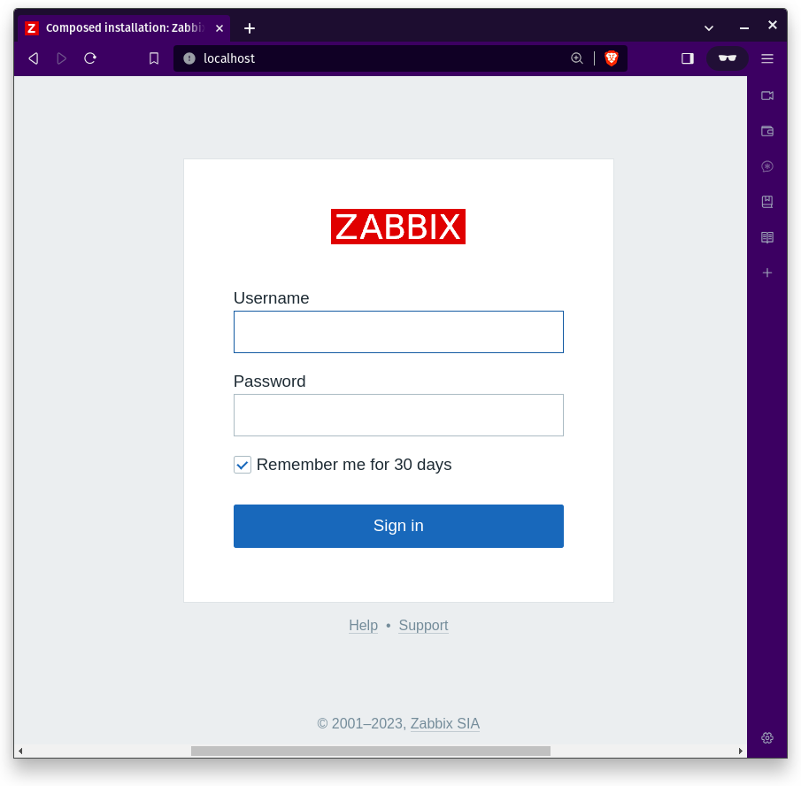

# Zabbix with Docker

We used the docker compose file from [here](https://github.com/zabbix/zabbix-docker/blob/6.4/docker-compose_v3_centos_pgsql_latest.yaml).

### Get started

Run docker from the docker compose file provided

```
$ docker compose up
```

Once you pull the images and build and run the container you can open the Zabbix Server on `localhost` using the credentials provided by Zabbix.com [on 1 Login and configuring user](https://www.zabbix.com/documentation/6.4/en/manual/quickstart/login)

> username: Admin
> password: zabbix


