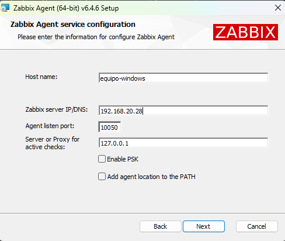
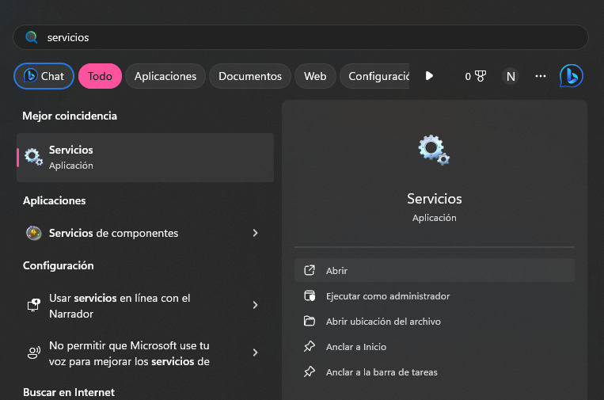
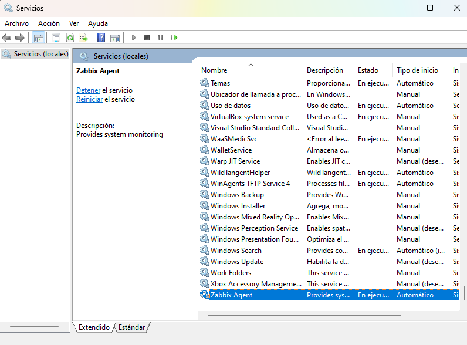
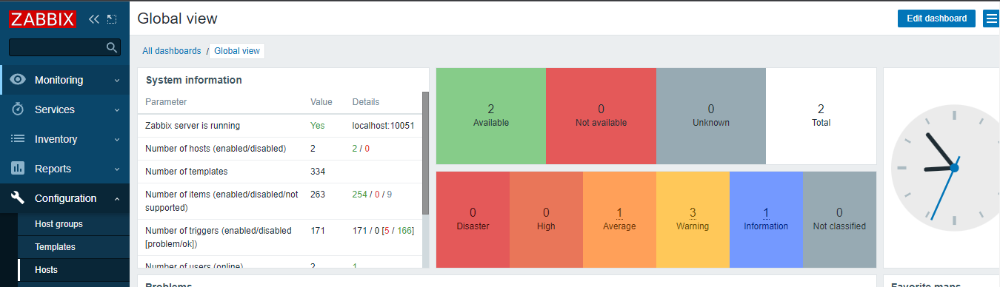
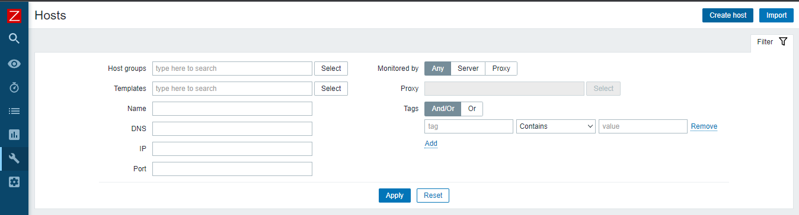
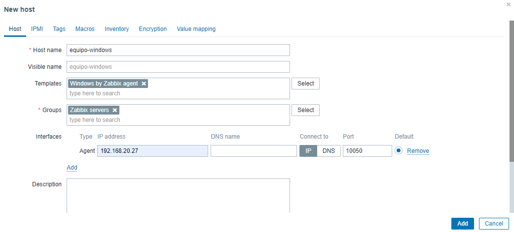
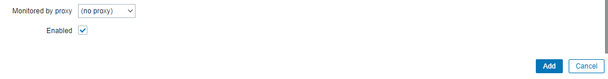
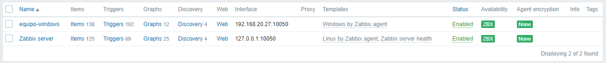
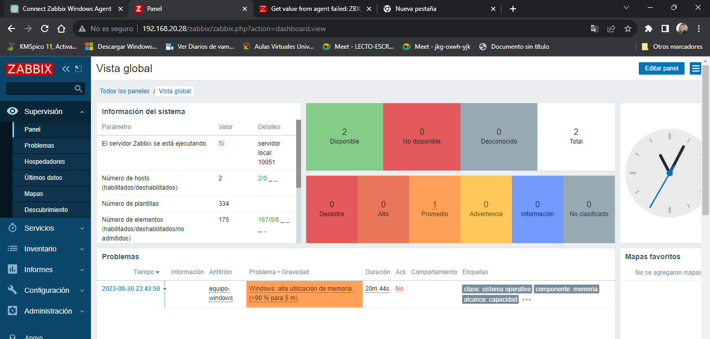
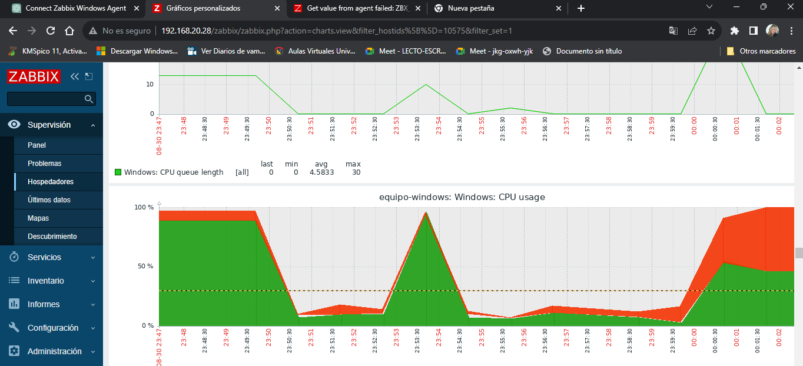

# Zabbix with Docker

We used the docker compose file from [here](https://github.com/zabbix/zabbix-docker/blob/6.4/docker-compose_v3_centos_pgsql_latest.yaml).

### Get started

Run docker from the docker compose file provided

```
$ docker compose up
```

Once you pull the images and build and run the container you can open the Zabbix Server on `localhost` using the credentials provided by Zabbix.com [on 1 Login and configuring user](https://www.zabbix.com/documentation/6.4/en/manual/quickstart/login)

> username: Admin
> password: zabbix


# Installation and Configuration of Zabbix Agent on Windows  

## Installation of Zabbix Agent on Windows

### Prerequisites Before you begin, make sure you have the following prerequisites: 

- An account with administrator privileges on the Windows system.
- The Zabbix Agent installation package for Windows, which you can download from the official Zabbix site. 

### Installation Steps  

1. **Download the installation package** of Zabbix Agent for Windows from the official Zabbix website: [go to the official site](https://www.zabbix.com/download_agents). 
2.  **Run the downloaded installation file**. Select the installation language and click "Next". 
3. Accept the license terms and click "Next". 
4.  **Specify the installation location**. By default, it will be installed in `C:\Program Files\Zabbix Agent`, but you can choose another location if you wish. Click "Next" to proceed. 
5. On the next screen, **configure the agent options**: 
-  **Server**: Enter the IP address or name of the Zabbix server to which the agent will connect. 
-  **Hostname**: Define a name for the agent on the Zabbix server. This should match the host name on the Zabbix server. 
-  **Port**: Leave the default port 10050 unless it has been configured differently on the Zabbix server. 



6. On the next screen, review the configuration and click "Install" to start the installation. 
7. Once the installation is complete, check the "Start Zabbix agent" box and then click "Finish" to start the agent. 
8.  **Verify the agent status**: Open the start menu and in the search bar, type 'services' and click to open. Then, check the list of services to ensure that Zabbix Agent is running.




 
## Configuration of Zabbix Agent on the Zabbix Server 
 
After installing the Zabbix Agent on a Windows system, you need to perform the corresponding configuration on the Zabbix server so that it can collect data from this agent. 
 
The following steps detail the process: 
 
1.  **Log in to the Zabbix server**: Access the Zabbix server through its web interface using your web browser (default user: Admin - password: zabbix). 
2.  **Access the "Hosts" section**: In the left-hand side navigation bar, click on "Configuration" and then select "Hosts". 



3.  **Create a new host**: Click on the "Create Host" button in the top right corner of the page. 



4.  **Complete the host details**: 
 -  **Host name**: Enter the same name you configured in the agent configuration file on Windows. 
 -  **Visible name**: You can assign a more descriptive name for the host if you wish. 
 -  **Groups**: You can assign the host to an existing group or create a new one. 
 -  **Agent interfaces**: Leave the configuration with the IP of the computer hosting the agent and port 10050. 
5. In the "Templates" section, **assign templates to the host** if desired. Templates contain a series of predefined monitoring items that will be applied to the host. You can use Zabbix's default templates or create your own. 



6. On the "Enabled" tab, **check the "Enabled" box** to activate the host. 
7.  **Click "Add"** to save the host configuration. 



8. Now, the Zabbix server will start collecting data from the Zabbix Agent on Windows based on the templates and items you have configured.



9. Verify the main dashboard where you can observe two hosts.

 

10. Validate the monitoring of the host connected to the network.

 

